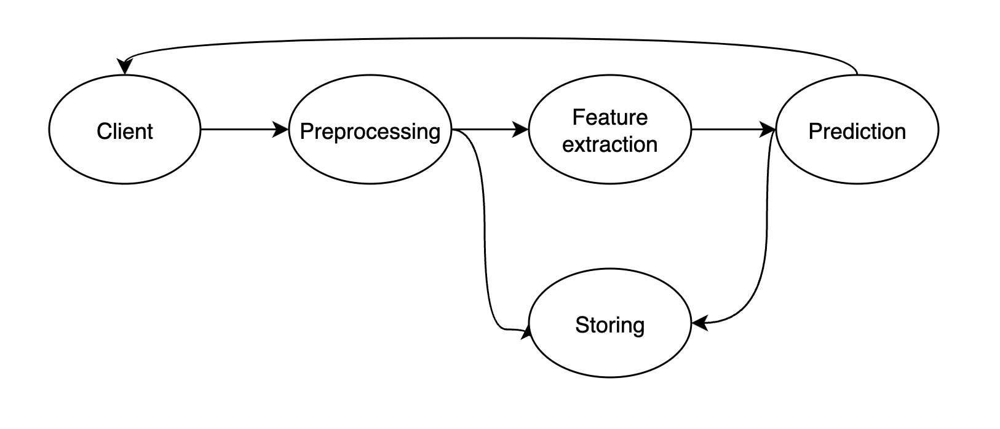
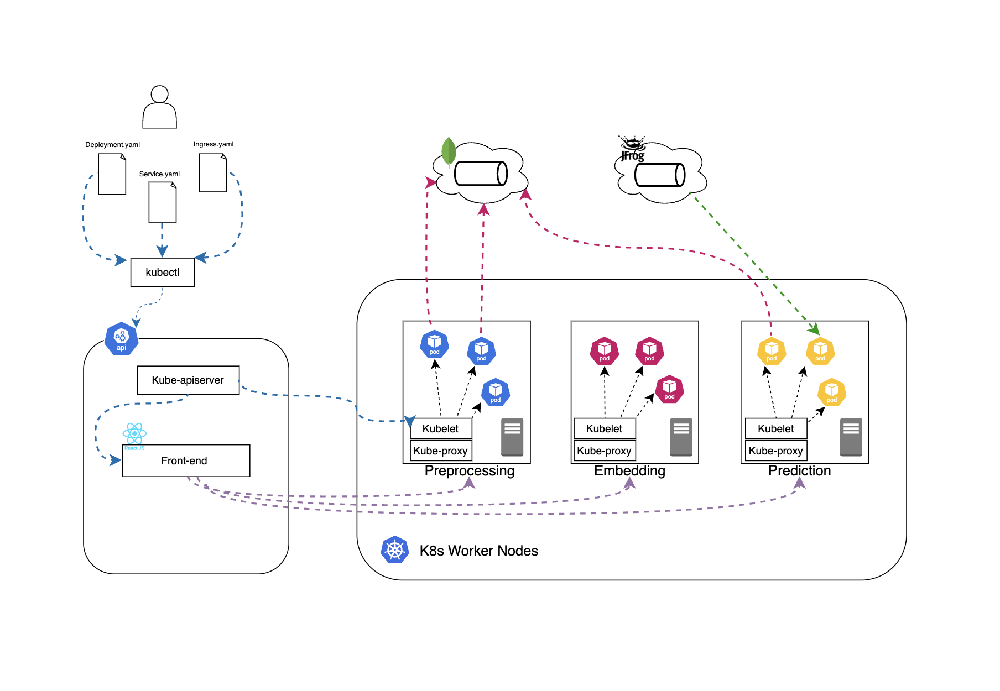

# Sentiment Analysis Application with Federated Learning

## 1. Context of the Application

This application focuses on implementing and deploying a federated deep learning algorithm for sentiment analysis of social network data, specifically tailored for the insurance industry. The goal is to develop a robust model that can interpret and act on customer feedback while preserving data privacy. Federated learning is employed to train models on decentralized data, ensuring user privacy and security by not transferring raw data to a central server.

## 2. Microservices Overview

The application is built using a microservices architecture, where each service is independently developed, deployed, and managed. The key microservices include:

- **Text Preprocessing Service**: Responsible for data cleaning, tokenization, stemming, and lemmatization to prepare raw text data for analysis.
- **Feature Extraction Service**: Utilizes advanced embedding techniques like ELECTRA to transform text data into numerical vectors suitable for machine learning models.
- **Model Service**: Implements the federated learning model deployed as an artefact in the cloud (JFrog).
- **Frontend Service**: A user-facing interface that interacts with backend services to display results and manage user input.


## 3. End-to-End Learning Pipeline

### Data Flow Diagram

Below is a data flow diagram illustrating the process from client input to final prediction:



### Data Description

The dataset used consists of 11,013 client reviews from an insurance database, including various columns like Feeling (sentiment category), Id (unique identifier), Company (company name), Text (review content), Month, and Year. The analysis primarily focuses on the Feeling and Text columns.

### Preprocessing

Preprocessing involves cleaning the dataset by removing noise such as punctuation and URLs, tokenizing text into words or phrases, stemming and lemmatization to reduce words to their base forms, and removing stop words that do not contribute to sentiment analysis. This stage ensures the quality of the dataset for subsequent analysis.

### Feature Extraction and Model Training

The feature extraction phase employs ELECTRA, a transformer-based model known for its efficiency in embedding textual data. GPU acceleration via CUDA is used to expedite training, reducing time from 6 minutes to 2 minutes. The training process involves dividing the dataset into multiple batches to simulate decentralized data across various clients in a federated network.

### Data Preparation for Federation

Data preparation for federated learning involves segmenting the dataset into 24 distinct batches, simulating the distribution across various nodes in a federated network. Only 14 out of these 24 batches are selected to act as clients, reflecting real-world scenarios where some nodes may be offline, to assess the model's resilience under limited conditions.

### Model Architecture and Federation

A Convolutional Neural Network (CNN) is chosen for the model due to its efficiency in handling text data and its ability to offer minimum training time. The TensorFlow Federated (TFF) library is utilized to develop and execute the model across decentralized data sources. The FedAvg algorithm aggregates model updates from different clients, enhancing the global model iteratively.

### Fine-Tuning and Evaluation

The fine-tuning phase involves optimizing hyperparameters such as learning rates and batch sizes to enhance model performance. Results from fine-tuning show significant improvements in training accuracy from 73.30% to 96.25% and recall from 79% to 98%, though validation accuracy showed modest gains, indicating potential overfitting.

## 4. Deployment Steps

### Deploying with Docker Swarm

1. **Initialize Docker Swarm**:
   ```bash
   docker swarm init
   ```

2. **Create a `docker-compose.yml` File**:
   ```yaml
   version: '3.8'
   services:
     frontend:
       image: frontend
       ports:
         - "80:80"
     text-cleaning:
       image: text-cleaning
     embedding:
       image: embedding
     modeling:
       image: modeling
     database:
       image: postgres
       environment:
         POSTGRES_PASSWORD: example
   ```

3. **Deploy the Application Stack**:
   ```bash
   docker stack deploy -c docker-compose.yml myapp
   ```

4. **Monitor the Services**:
   ```bash
   docker service ls
   ```

### Docker Images Overview

The following image shows the Docker images used for each service:


### Deploying with Kubernetes

1. **Set Up Kubernetes Cluster**:
   Ensure you have a Kubernetes cluster running.

2. **Create Deployment Files for Kubernetes**:

   Below are examples of Kubernetes YAML configuration files for deploying each microservice.

#### Example Kubernetes Configuration

```yaml
apiVersion: apps/v1
kind: Deployment
metadata:
  name: main-deployment
  namespace: senthelp
  labels:
    tier: front-end
spec:
  replicas: 1
  selector:
    matchLabels:
      tier: front-end
  template:
    metadata:
      labels:
        tier: front-end
    spec:
      containers:
      - name: main
        image: audhub/senthelp:main-v-2.0
        ports:
        - containerPort: 5000
        resources:
          limits:
            cpu: 300m
            memory: 500Mi
          requests:
            cpu: 100m
            memory: 200Mi
        securityContext:
          runAsNonRoot: true
          runAsUser: 10001
          capabilities:
            drop: ["all"]
          readOnlyRootFilesystem: false
        volumeMounts:
        - mountPath: /usr/src/app/static/gen
          name: gen-storage
        env:
        - name: TMPDIR
          value: /tmp
        - name: TRANSFORMERS_CACHE
          value: /tmp/cache
        - name: ZIPKIN_HOST
          value: "zipkin.senthelp.svc.cluster.local"
        - name: ZIPKIN_PORT
          value: "9411"
      imagePullSecrets:
      - name: private-reg-cred
      volumes:
      - name: gen-storage
        emptyDir: {}
---
apiVersion: v1
kind: Service
metadata:
  name: main-service
  namespace: senthelp
spec:
  type: ClusterIP 
  ports:
  - port: 5000
    targetPort: 5000
  selector:
    tier: front-end
---
apiVersion: apps/v1
kind: Deployment
metadata:
  name: clean-text-deployment
  namespace: senthelp
  labels:
    tier: back-end-clean
spec:
  replicas: 1
  selector:
    matchLabels:
      tier: back-end-clean
  template:
    metadata:
      labels:
        tier: back-end-clean
    spec:
      containers:
      - name: clean-text
        image: audhub/senthelp:clean-text-v-2.0
        ports:
        - containerPort: 5002
        resources:
          limits:
            cpu: 300m
            memory: 500Mi
          requests:
            cpu: 100m
            memory: 200Mi
        securityContext:
          runAsNonRoot: true
          runAsUser: 10001
          capabilities:
            drop: ["all"]
          readOnlyRootFilesystem: true
        env:
        - name: TMPDIR
          value: /tmp
        - name: TRANSFORMERS_CACHE
          value: /tmp/cache
        - name: ZIPKIN_HOST
          value: "zipkin.senthelp.svc.cluster.local"
        - name: ZIPKIN_PORT
          value: "9411"
        livenessProbe:
          tcpSocket:
            port: 5002
          initialDelaySeconds: 10
          periodSeconds: 5
        readinessProbe:
          tcpSocket:
            port: 5002
          initialDelaySeconds: 5
          periodSeconds: 5
      imagePullSecrets:
      - name: private-reg-cred
      volumes:
      - name: temp-storage
        emptyDir: {}
---
apiVersion: v1
kind: Service
metadata:
  name: clean-text
  namespace: senthelp
spec:
  type: ClusterIP  
  ports:
  - port: 5002
    targetPort: 5002
  selector:
    tier: back-end-clean
---
apiVersion: apps/v1
kind: Deployment
metadata:
  name: embedding-deployment
  namespace: senthelp
  labels:
    tier: back-end-embedding
spec:
  replicas: 1
  selector:
    matchLabels:
      tier: back-end-embedding
  template:
    metadata:
      labels:
        tier: back-end-embedding
    spec:
      containers:
      - name: embedding-service
        image: audhub/senthelp:embedding-service-v-2.0
        ports:
        - containerPort: 5003
        resources:
          limits:
            cpu: 300m
            memory: 500Mi
          requests:
            cpu: 100m
            memory: 200Mi
        securityContext:
          runAsNonRoot: true
          runAsUser: 10001
          capabilities:
            drop: ["all"]
          readOnlyRootFilesystem: true
        env:
        - name: TMPDIR
          value: /tmp
        - name: TRANSFORMERS_CACHE
          value: /tmp/cache
        - name: ZIPKIN_HOST
          value: "zipkin.senthelp.svc.cluster.local"
        - name: ZIPKIN_PORT
          value: "9411"
        volumeMounts:
        - mountPath: /tmp/cache
          name: cache-storage
      imagePullSecrets:
      - name: private-reg-cred
      volumes:
      - name: temp-storage
        emptyDir: {}
      - name: cache-storage
        emptyDir: {}
---
apiVersion: v1
kind: Service
metadata:
  name: embedding-service
  namespace: senthelp
spec:
  type: ClusterIP  
  ports:
  - port: 5003
    targetPort: 5003
  selector:
    tier: back-end-embedding
---
apiVersion: apps/v1
kind: Deployment
metadata:
  name: model-deployment
  namespace: senthelp
  labels:
    tier: back-end-modeling
spec:
  replicas: 1
  selector:
    matchLabels:
      tier: back-end-modeling
  template:
    metadata:
      labels:
        tier: back-end-modeling
    spec:
      containers:
      - name: model-service
        image: audhub/senthelp:model-service-v-2.0
        ports:
        - containerPort: 5004
        resources:
          limits:
            cpu: 300m
            memory: 500Mi
          requests:
            cpu: 100m
            memory: 200Mi
        securityContext:
          runAsNonRoot: true
          runAsUser: 10001
          capabilities:
            drop: ["all"]
          readOnlyRootFilesystem: true
        env:
        - name: TMPDIR
          value: /tmp
        - name: TRANSFORMERS_CACHE
          value: /tmp/cache
        - name: ZIPKIN_HOST
          value: "zipkin.senthelp.svc.cluster.local"
        - name: ZIPKIN_PORT
          value: "9411"
        volumeMounts:
        - name: temp-storage
          mountPath: /tmp
      imagePullSecrets:
      - name: private-reg-cred
      volumes:
      - name: temp-storage
        emptyDir: {}
---
apiVersion: v1
kind: Service
metadata:
  name: model-service
  namespace: senthelp
spec:
  type: ClusterIP  
  ports:
  - port: 5004
    targetPort: 5004
  selector:
    tier: back-end-modeling
---
apiVersion: autoscaling/v2
kind: HorizontalPodAutoscaler
metadata:
  name: main-deployment-hpa
  namespace: senthelp
spec:
  scaleTargetRef:
    apiVersion: apps/v1
    kind: Deployment
    name: main-deployment
  minReplicas: 1
  maxReplicas: 5
  metrics:
  - type: Resource
    resource:
      name: cpu
      target:
        type: Utilization
        averageUtilization: 50
---
apiVersion: autoscaling/v2
kind: HorizontalPodAutoscaler
metadata:
  name: clean-text-deployment-hpa
  namespace: senthelp
spec:
  scaleTargetRef:
    apiVersion: apps/v1
    kind: Deployment
    name: clean-text-deployment
  minReplicas: 1
  maxReplicas: 5
  metrics:
  - type: Resource
    resource:
      name: cpu
      target:
        type: Utilization
        averageUtilization: 50
---
apiVersion: autoscaling/v2
kind: HorizontalPodAutoscaler
metadata:
  name: embedding-deployment-hpa
  namespace: senthelp
spec:
  scaleTargetRef:
    apiVersion: apps/v1
    kind: Deployment
    name: embedding-deployment
  minReplicas: 1
  maxReplicas: 5
  metrics:
  - type: Resource
    resource:
      name: cpu
      target:
        type: Utilization
        averageUtilization: 50
---
apiVersion: autoscaling/v2
kind: HorizontalPodAutoscaler
metadata:
  name: model-deployment-hpa
  namespace: senthelp
spec:
  scaleTargetRef:
    apiVersion: apps/v1
    kind: Deployment
    name: model-deployment
  minReplicas: 1
  maxReplicas: 5
  metrics:
  - type: Resource
    resource:
      name: cpu
      target:
        type: Utilization
        averageUtilization: 50
```

3. **Apply the Deployment Files**:
   ```bash
   kubectl apply -f service-deployment.yaml
   ```

4. **Monitor Pods and Services**:
   ```bash
   kubectl get pods
   kubectl get services
   ```

### Kubernetes Architecture Overview

The following diagram illustrates the Kubernetes architecture for deploying the microservices:



## 5. Load Testing with Locust

Locust is used to perform load testing on the application to evaluate its performance under high traffic.

### Steps to Run Locust Test

1. **Install Locust**:
   ```bash
   pip install locust
   ```

2. **Create a Locust Test File** (`locustfile.py`):

   ```python
   from locust import HttpUser, task, between

   class WebsiteUser(HttpUser):
       wait_time = between(1, 5)

       @task
       def load_test(self):
           self.client.get("/")
   ```

3. **Run Locust**:
   ```bash
   locust -f locustfile.py --host http://your-app-url
   ```

4. **Open the Locust Web Interface**:
   Navigate to `http://localhost:8089` in your web browser.

5. **Start the Test**:
   Set the number of users and spawn rate, then click "Start swarming" to begin the load test.


## Conclusion

This README provides an overview of the application's context, microservices, deployment steps, and testing methods. The application is designed to be scalable, privacy-preserving, and capable of handling high traffic efficiently using modern machine-learning techniques and a federated learning approach.
